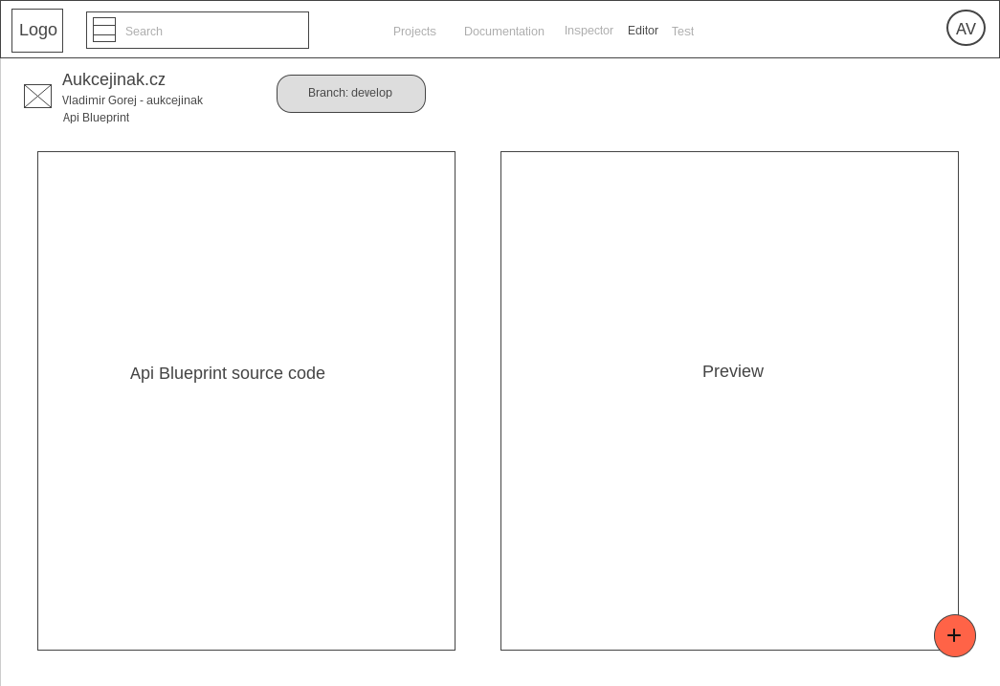
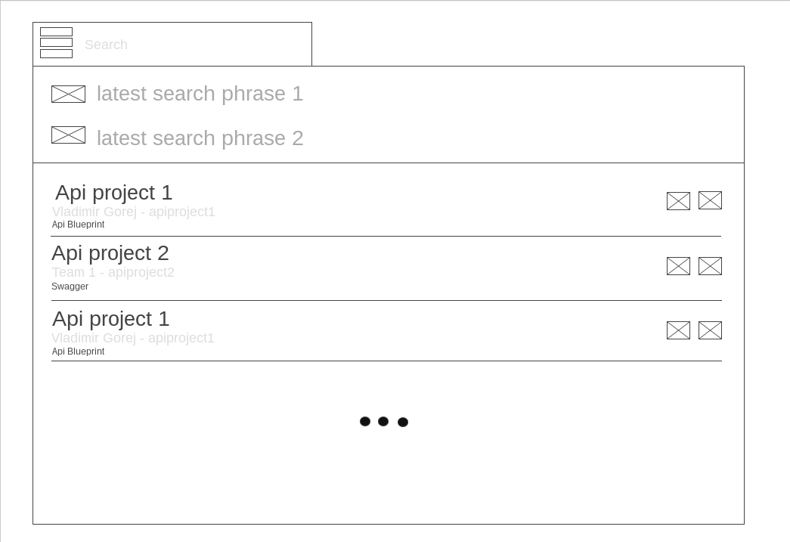
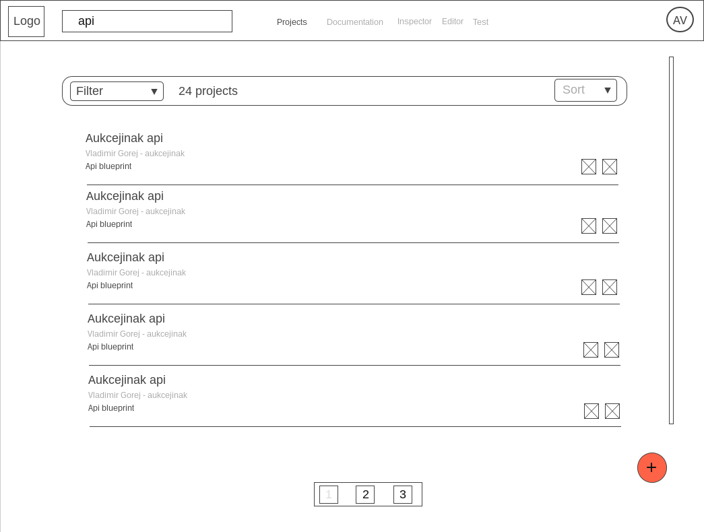

# Proposal for enhancement of apiary SWITCH component

## Infra

I've used [@facebookincubator/create-react-app](https://github.com/facebookincubator/create-react-app) to setup the initial repo and it provides
everything that we need to rapidly prototype any react concept.

## Wireframes

Wireframes were created via https://wireframe.cc. Email vladimir.gorej@gmail.com to request access.
Please refer to the annotations of the wireframe.cc proposal for expected behaviors. This code
should act as a reference implementation of the wireframes.    





## Approach

For the enhancement of the switch component  I've decided to use material design visual language
and all it's principles. I think it is a right direction for us to take this path if we  
want to introduce more modern and user friendly switch component with more features 
and better accessibility.

I've used material-ui as a reference implementation of material design in React. 
It allowed me to do rapid prototyping. I used airbnb codestyle and eslint to keep
me in line with this codestyle and to be consistent.

I've used presentational [components and containers pattern](https://medium.com/@dan_abramov/smart-and-dumb-components-7ca2f9a7c7d0)
to create components using React and Redux. 
Redux manages the state of the application  via its reducers. I've used [BEM](http://getbem.com/introduction/)
to write CSS styles. Font-awesome is used for icons, it contained icons I needed to get the job done.
I've used github to make the implementation of the prototype public. For commit messages I've used
conventional changelog angular flavor. Writing commit messages in strict format allows me to generated
changelog in the future.

There is only one test that guarantees the project integrity. Due to time constrains and to the fact
that this is just a prototype I did not write any additional tests. If this was real world application
I would start with unitests covering redux reducers and selectors, and then I've used enzyme for component unit
or integration tests. It is also possible to use selenium webdriver to deliver more complex integration tests.

I've tried to make all code as much declarative as possible. I prefer code to be declarative in first place
and then only when necessary add comments enplaning the additional complexity of the code. 

I've used ES2016 to write the codebase.

### Things learned

I would suggest the Search Component to search also in blueprints source code. IMHO it would be quite 
practical for the users to have this feature. Of course the priority algorithm of the search results
will have to thought out carefully.

Latest search in Search Component also seems promising. It allows me to list all my api projects matching
string pattern on two clicks.

### Project structure

```
 src/
   /components - global components ment to be reused accross entire application
   /layouts - components that dictates major page structure
   /modules - self contained features not directly associated with any scene
   /scenes - main application routes
   /store - redux specific machinery
   /index.js - main entry point for React
```

### TODO

Api project list
 - Sorting
 - Filters
 - Pagination
 
There are [open issues](https://github.com/char0n/apiary-switch/issues) for these features on github.
I did not implement these features because I did not considered them important to the demonstration
of the switch component itself. They can be implemented at a later time if necessary.
